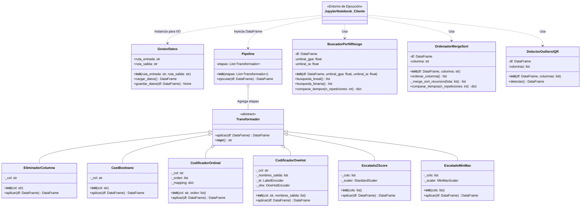
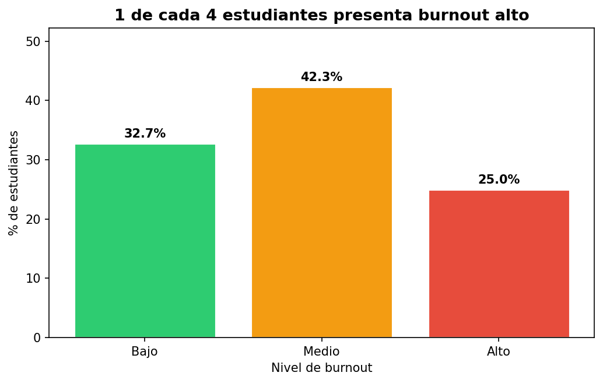
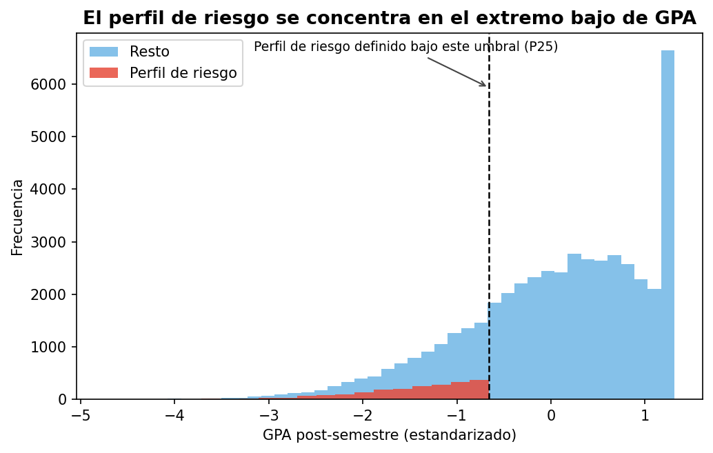
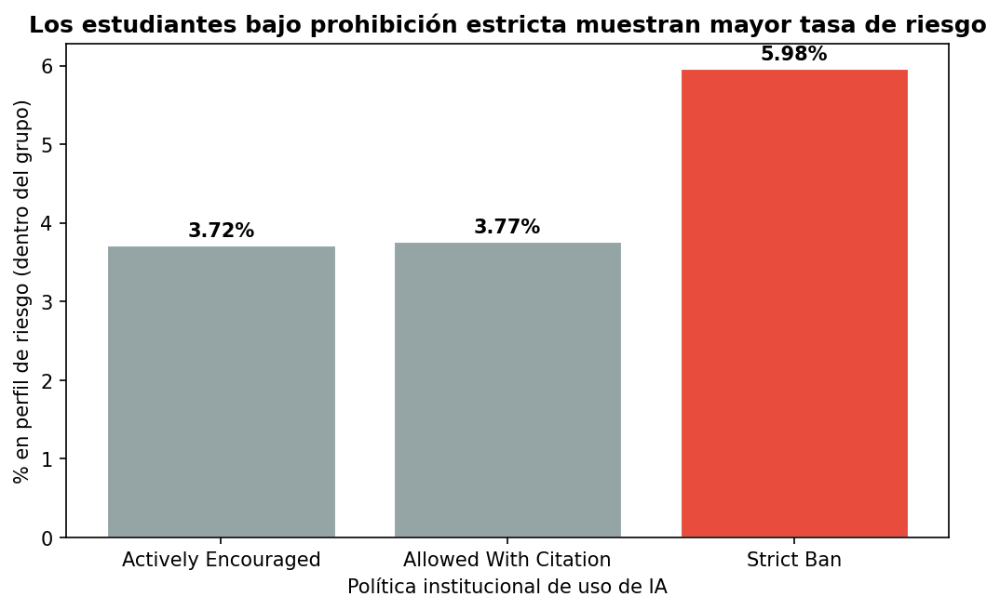

# MCDI500 - Impacto de la IA Generativa en Estudiantes

## Grupo 1 | MCDI500 - Programación para la ciencia de datos

### Integrantes

- Pablo Ignacio Balbontin Constenla @pabbalbontin-maker
- Melany Esmeralda Reyes Leiva @melanyreyesy
- Ingeborg Andrea Munoz Carnot @dark452
- Mario Alejandro Lopez Pulgar @malp2203

### Descripción de problemática

El objetivo del proyecto es realizar un análisis del impacto de la utilización y frecuencia  de uso de la IA generativa sobre el rendimiento académico y el nivel de agotamiento de estudiantes universitarios.

*Dataset (AI student impact)*:

- 50.000 registros
- 16 columnas

*Columnas de interés*:

- Post_Semester_GPA (rendimiento académico)
- Burnout_Risk_Level (nivel de agotamiento de los estudiantes universitarios)

*Estadísticas descriptivas del dataset*:


|       |    Student_ID |   Pre_Semester_GPA |   Weekly_GenAI_Hours |   Tool_Diversity |   Traditional_Study_Hours |   Perceived_AI_Dependency |   Anxiety_Level_During_Exams |   Post_Semester_GPA |   Skill_Retention_Score |
|:------|--------------:|-------------------:|---------------------:|-----------------:|--------------------------:|--------------------------:|-----------------------------:|--------------------:|------------------------:|
| count |  50000.000000 |       50000.000000 |         50000.000000 |     50000.000000 |              50000.000000 |              50000.000000 |                 50000.000000 |        50000.000000 |            50000.000000 |
| mean  | 125000.500000 |           3.146102 |             8.427752 |         2.800260 |                 11.209271 |                  3.505360 |                     4.270760 |            3.349299 |               75.798125 |
| std   |  14433.901067 |           0.478854 |             8.269490 |         1.188020 |                  5.156426 |                  1.820812 |                     2.144066 |            0.495673 |               13.281626 |
| min   | 100001.000000 |           1.183000 |             0.000000 |         1.000000 |                  1.000000 |                  1.000000 |                     1.000000 |            1.000000 |               10.780000 |
| 25%   | 112500.750000 |           2.834000 |             2.390000 |         2.000000 |                  7.560000 |                  2.000000 |                     3.000000 |            3.023750 |               66.820000 |
| 50%   | 125000.500000 |           3.210000 |             5.800000 |         3.000000 |                 11.180000 |                  3.000000 |                     4.000000 |            3.421000 |               76.000000 |
| 75%   | 137500.250000 |           3.521000 |            11.720000 |         4.000000 |                 14.710000 |                  5.000000 |                     6.000000 |            3.749000 |               85.190000 |
| max   | 150000.000000 |           3.998000 |            40.000000 |         5.000000 |                 35.860000 |                 10.000000 |                    10.000000 |            4.000000 |              100.000000 |

### Estructura del repositorio

```bash
mcdi500_s1_grupo1/
├── data/
│   ├── raw/                        # dataset original (INMUTABLE)
│   └── processed/                  # datos transformados (F2 y F3)
├── notebooks/
│   ├── F1_Definicion.ipynb
│   ├── F2_EDA_Limpieza.ipynb
│   ├── F3_Rendimiento_POO.ipynb     
│   └── F4_Integrador.ipynb     
├── src/
│   ├── functions.py                # F2 — pipeline funcional (preprocesamiento)
│   ├── gestor_datos.py             # F3 — GestorDatos (carga y exportación)
│   ├── transformador.py            # F3 — Transformador (ABC) y subclases
│   ├── preprocesador.py            # F3 — Preprocesador, Pipeline
│   └── algoritmo.py                # F3 — núcleo algorítmico (búsqueda, orden, outliers)
├── docs/                           # documentacion adicional
│   └── changelog.md                #(markdown con changelog) 
├── requirements.txt
└── README.md
```

### Cómo reproducir el entorno

El siguiente procedimiento, permite clonar el repositorio remoto en un entorno local.

```bash
git clone https://github.com/dark452/mcdi500_s1_grupo1.git
cd mcdi500_s1_grupo1
python -m venv .venv
source .venv/bin/activate   # Windows: .venv\Scripts\activate
pip install numpy pandas scikit-learn matplotlib seaborn jupyter
pip freeze > requirements.txt
jupyter notebook notebooks/F4_Integrador.ipynb #Se puede ejecutar cualquier Fase
```

### Fase 2 — EDA y Preparación de Datos

*Proyecto:* Impacto de la IA Generativa en Estudiantes de Educación Superior  

#### Objetivo

Explorar el dataset en profundidad, limpiar y transformar los datos para dejarlos listos para la etapa de modelado.

#### Funcionalidades

1. *Limpieza de datos*: Tratamiento de inconsistencias y valores atípicos si se identifican.
2. *Codificación de variables categóricas*: Transformar variables nominales y ordinales a formato numérico.
3. *Escalamiento de variables numéricas*: Normalizar o estandarizar según la distribución de cada variable.
4. *Exportación*: Guardar los datos transformados en data/processed/ para uso en F3.

#### Librerías utilizadas

Se importan las librerías necesarias para cargar, explorar, transformar y visualizar el dataset.

| Librería | Función |
|---|---|
| `pandas` | Cargar y manipular la tabla de datos (el `DataFrame`). |
| `numpy` | Operaciones numéricas y fijación de semilla aleatoria. |
| `matplotlib` / `seaborn` | Visualizaciones del EDA (histogramas, boxplots, heatmap). |
| `sklearn.preprocessing` | Las herramientas de codificación (`LabelEncoder`, `OneHotEncoder`) y escalamiento de variables numéricas (`StandardScaler`, `MinMaxScaler`). |

`np.random.seed(42)` fija la semilla aleatoria: garantiza que cualquier proceso con azar dé **siempre el mismo resultado**, asegurando la *reproducibilidad* exigida en la fase.

#### Funciones para reutilizar en el código Python

* **`load_data(file_path)`**: Carga el dataset desde un archivo CSV y retorna un DataFrame con los datos.
* **`show_tipos(df)`**: Muestra las columnas del dataset y el tipo de dato de cada una.
* **`show_nulos(df)`**: Muestra la cantidad de valores nulos por columna.
* **`show_estadisticas(df)`**: Muestra estadísticas descriptivas del dataset.
* **`show_categories(df)`**: Muestra la frecuencia de valores por columna categórica.
* **`mostrar_boxplots(df, columnas, titulo)`**: Genera un boxplot por cada columna numérica recibida por parámetro.
* **`detectar_outliers(df, columnas)`**: Detectar valores atípicos mediante el método IQR y retorna una tabla resumen.
* **`compute_skewness(df, cols)`**: Calcula el *skewness* de columnas numéricas, recomienda el escalador adecuado y retorna un DataFrame con los resultados.
* **`drop_id_column(df, col)`**: Elimina del DataFrame la columna recibida por parámetro.
* **`cast_bool_to_int(df, col)`**: Convierte una columna booleana a entero (`False` → 0, `True` → 1) y retorna el DataFrame con la columna en tipo `int64`.
* **`encode_ordinal(df, col, order)`**: Codifica una variable ordinal asignando enteros según el orden definido y retorna el DataFrame con la columna reemplazada.
* **`codificar_one_hot(df, col, nombres)`**: Codifica una variable nominal mediante `LabelEncoder` y `OneHotEncoder`, retornando el DataFrame con las columnas binarias añadidas y la columna original eliminada.
* **`escalar_caracteristicas(df, cols_standard, cols_minmax)`**: Escala las variables numéricas aplicando `StandardScaler` o `MinMaxScaler` según la distribución de cada columna, y retorna una tupla con el DataFrame escalado y ambos escaladores ajustados.
* **`export_processed(df, file_path)`**: Exporta el dataset procesado en formato CSV en la ruta recibida por parámetro.

---

### Fase 3 — POO, Algoritmos y Eficiencia Computacional

*Proyecto:* Impacto de la IA Generativa en Estudiantes de Educación Superior

#### Objetivo

Refactorizar el pipeline de preprocesamiento de la Fase 2 hacia Programación Orientada a Objetos (POO), definir y resolver un problema algorítmico sobre el dataset, y medir la eficiencia computacional de las soluciones implementadas con `timeit`.

#### Problema algorítmico definido

¿Qué estudiantes presentan el perfil de mayor riesgo académico, combinando alto nivel de burnout (`Burnout_Risk_Level = High`), bajo rendimiento post-semestre (`Post_Semester_GPA` ≤ percentil 25) y uso intensivo de IA (`Weekly_GenAI_Hours` ≥ percentil 75)?

#### Funcionalidades

1. *Encapsulamiento del pipeline de F2*: las funciones de `functions.py` se reorganizan como métodos de la clase `Preprocesador`, con estado interno protegido y métodos encadenables.
2. *Búsqueda del perfil de riesgo*: búsqueda lineal O(n) y vectorizada sobre el dataset completo; búsqueda binaria O(log n) sobre la columna de GPA ordenada.
3. *Ordenamiento recursivo*: Merge Sort (divide y vencerás, O(n log n)) sobre `Post_Semester_GPA`.
4. *Detección de outliers*: método IQR aplicado a las ocho variables numéricas del dataset.
5. *Medición de eficiencia*: comparación con `timeit` entre implementaciones equivalentes (lineal vs. vectorizada; Merge Sort vs. `sorted()` nativo), con interpretación en términos de complejidad Big-O.
6. *Validación técnica*: pruebas de caso normal, caso límite y excepciones controladas (`KeyError`, `ValueError`).

#### Arquitectura de clases

**Diagrama de clases**
A continuación un diagrama de clases de la fase 3 y una tabla con las especificaciones de cada clase/método.


| Módulo (`src/`) | Clase | Responsabilidad |
|---|---|---|
| `gestor_datos.py` | `GestorDatos` | Carga el dataset raw y exporta el dataset procesado (E/S exclusivamente). |
| `transformador.py` | `Transformador` (ABC) | Contrato común: define `aplicar(df)` como método abstracto. |
| `transformador.py` | `EliminadorColumna` | Elimina columnas sin valor predictivo (p. ej. `Student_ID`). |
| `transformador.py` | `CastBooleano` | Convierte columnas booleanas a `int64`. |
| `transformador.py` | `CodificadorOrdinal` | Codifica variables ordinales respetando su jerarquía real. |
| `transformador.py` | `CodificadorOneHot` | Codifica variables nominales con `LabelEncoder` + `OneHotEncoder`. |
| `transformador.py` | `EscaladoZScore` | Estandariza variables con `StandardScaler` (media=0, std=1). |
| `transformador.py` | `EscaladoMinMax` | Normaliza variables con `MinMaxScaler` (rango [0, 1]). |
| `preprocesador.py` | `Pipeline` | Orquesta una lista de `Transformador` en orden (polimorfismo). |
| `preprocesador.py` | `Preprocesador` | Encapsula el pipeline completo de F2; estado interno protegido (`self._df`). |
| `algoritmo.py` | `BuscadorPerfilRiesgo` | Búsqueda lineal, vectorizada y binaria del perfil de riesgo. |
| `algoritmo.py` | `OrdenadorMergeSort` | Merge Sort recursivo sobre una columna numérica. |
| `algoritmo.py` | `DetectorOutliersIQR` | Detección de valores atípicos por rango intercuartílico. |
| `algoritmo.py` | `AnalizadorRiesgo` | Orquesta los tres módulos algorítmicos anteriores. |

#### Principios de POO aplicados

- **Encapsulamiento**: el `DataFrame` vive en atributos protegidos (`self._df`); solo se exponen métodos públicos para modificarlo.
- **Herencia**: todas las transformaciones heredan de `Transformador` (clase abstracta) e implementan `aplicar(df)`.
- **Polimorfismo**: `Pipeline.ejecutar()` llama `etapa.aplicar(df)` sin conocer la subclase concreta.
- **Responsabilidad única**: cada clase resuelve exactamente un problema (E/S, transformación, búsqueda, orden o detección de outliers).

#### Clases para reutilizar en el código Python

* **`GestorDatos(ruta_entrada, ruta_salida)`**: `cargar_datos()` lee el CSV raw; `guardar_datos(df)` exporta el dataset procesado.
* **`Preprocesador(df)`**: `eliminar_id()`, `cast_bool()`, `codificar_ordinales()`, `codificar_nominales()`, `escalar()`, `validar()`, `resultado()`. Métodos encadenables (`prep.eliminar_id().cast_bool()...`).
* **`Pipeline(etapas)`**: `ejecutar(df)` aplica una lista de objetos `Transformador` en orden.
* **`BuscadorPerfilRiesgo(df)`**: `busqueda_lineal()`, `busqueda_binaria_gpa(lista, objetivo)`, `comparar_tiempos()`.
* **`OrdenadorMergeSort(df, col)`**: `merge_sort(lista)`, `ordenar_columna()`, `comparar_tiempos()`.
* **`DetectorOutliersIQR(df, columnas)`**: `detectar()`, `perfil_outliers()`.
* **`AnalizadorRiesgo(df)`**: `ejecutar_analisis_completo()` integra búsqueda, ordenamiento y detección de outliers en un solo flujo.

#### Resultados de referencia (50.000 registros)

| Métrica | Valor |
|---|---|
| Dataset procesado | 50.000 filas × 25 columnas |
| Estudiantes en perfil de riesgo | 2.094 (≈4,2 % del total) |
| Búsqueda vectorizada vs. lineal | Significativamente más rápida; mismo O(n), distinta constante de implementación (C vs. Python puro) |
| Merge Sort recursivo vs. `sorted()` nativo | `sorted()` más rápido; mismo O(n log n), `sorted()` implementado en C (Timsort) |

*Los tiempos exactos dependen del hardware de ejecución; ver el notebook de Fase 3 para los valores medidos en cada corrida con `timeit`.*

#### Limitaciones conocidas

#### Limitaciones conocidas (resueltas)

`CodificadorOneHot` ahora acepta un parámetro `categorias` con el catálogo completo de valores posibles, fijado una sola vez en `Preprocesador._NOMINALES`. El número de columnas binarias generadas ya no depende del tamaño del lote: una sola fila produce el mismo conjunto de 13 columnas OHE que el dataset completo, con ceros en las categorías ausentes. Adicionalmente, si un lote contiene una categoría fuera del catálogo declarado, se lanza `ValueError` con un mensaje explícito en vez de fallar.

### Fase 4 — Integración y Visualización

Esta fase integra de extremo a extremo las fases F1–F4: carga el dataset raw, ejecuta el pipeline de preprocesamiento POO construido en F3, corre el núcleo algorítmico (búsqueda, ordenamiento, detección de outliers) con sus mediciones de eficiencia, y construye las visualizaciones analíticas de F4 con su interpretación.

| Notebook | Fase |
|---|---|
|[F1_Definicion.ipynb](notebooks/F1_Definicion.ipynb) | Fase 1 - Definición |
| [F2_EDA_Limpieza.ipynb](notebooks/F2_EDA_Limpieza.ipynb) | Fase 2 - EDA y Limpieza |
| [F3_Rendimiento_POO.ipynb](notebooks/F3_Rendimiento_POO.ipynb) | Fase 3 - Rendimiento y POO | 
| [F4_Integrador.ipynb](notebooks/F4_Integrador.ipynb) | Fase 4 los integra y produce el resultado final reproducible. |

#### Funcionalidades F4

El notebook [F4_Integrador.ipynb](notebooks/F4_Integrador.ipynb) contiene 14 celdas de código organizadas en 11 secciones numeradas que siguen el flujo F1 ==> F4:

| Sección | Contenido | Resultado visible |
| :--- | :--- | :--- |
| **1. Configuración e importaciones** | Librerías, sys.path, módulos propios, rutas | [OK] Entorno configurado. |
| **2. Fase 1 - Recapitulación** | Carga del dataset raw con GestorDatos | Shape: 50.000 × 16, primeras filas |
| **3. Fase 2 - Recapitulación** | Resumen EDA y decisiones de preprocesamiento | Celda Markdown |
| **4. Fase 3 - Recapitulación** | Ejecución del pipeline POO y AnalizadorRiesgo | Traza de 14 transformaciones + tiempos |
| **5. Acto 1 (F4)** | Prevalencia de burnout alto | Gráfico de barras + interpretación |
| **6. Acto 2 (F4)** | Perfil de riesgo vs. resto | Histograma comparativo + interpretación |
| **7. Acto 3 (F4)** | Política institucional y tasa de riesgo | Gráfico de barras + interpretación |
| **8. Resultados** | Correspondencia de los 3 gráficos con objetivos | Celda Markdown |
| **9. Validación y reflexión técnica** | 3 assertions de cierre + reflexión grupal | [OK] Validaciones superadas. |
| **10. Discusión** | Contraste con hipótesis, limitaciones | Celda Markdown |
| **11. Conclusiones** | Aprendizajes y mejoras futuras | Celda Markdown |
| **12. Trazabilidad de mejoras** | Tabla comparativa F2 ==> F4 con commits | DataFrame con 4 filas |
| **13. Exportación final** | GestorDatos.guardar_datos(df_procesado) | CSV en data/processed/, 50.000 × 25 |

#### Visualizaciones analíticas (storytelling)

Las visualizaciones de la Fase 4 utilizan directamente el dataset procesado generado por el pipeline POO construido en la Fase 3 y reproducido en [F4_Integrador.ipynb](notebooks/F4_Integrador.ipynb), por lo que no requieren transformaciones adicionales. En la Fase 3 (sección 7 de [F3_Rendimiento_POO.ipynb](notebooks/F3_Rendimiento_POO.ipynb)) se generaron visualizaciones exploratorias del perfil de riesgo académico que mostraron por separado la distribución de burnout, el GPA y las horas de uso de IA. La Fase 4 retoma esas variables y las organiza en una narrativa estructurada de tres actos, pasando de la exploración descriptiva a la comunicación orientada al hallazgo.

Se crearon 3 actos:

- Acto 1 (contexto): Panorama general
- Acto 2 (conflicto): El contraste que define el perfil de riesgo
- Acto 3 (resolución): Una variable institucional que abre una implicancia práctica. Cada gráfico lleva un título que declara el hallazgo, no el tema, siguiendo la pista de la guía de apoyo.

#### Resultados

Las tres visualizaciones anteriores corresponden directamente a los objetivos específicos del proyecto (apartado III del informe):

##### Acto 1

Cuantifica la prevalencia del burnout alto (objetivo de caracterización descriptiva)


##### Acto 2

Valida que el criterio combinado de riesgo definido en F3 produce un subgrupo coherente y no disperso (objetivo de identificación del perfil de riesgo)


##### Acto 3

Relaciona ese perfil con una variable institucional no incluida en el criterio de búsqueda original, aportando una primera pista sobre qué factores externos se asocian al riesgo (objetivo de relación con factores institucionales).
